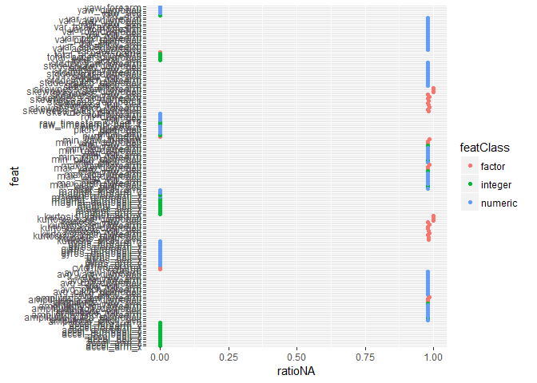
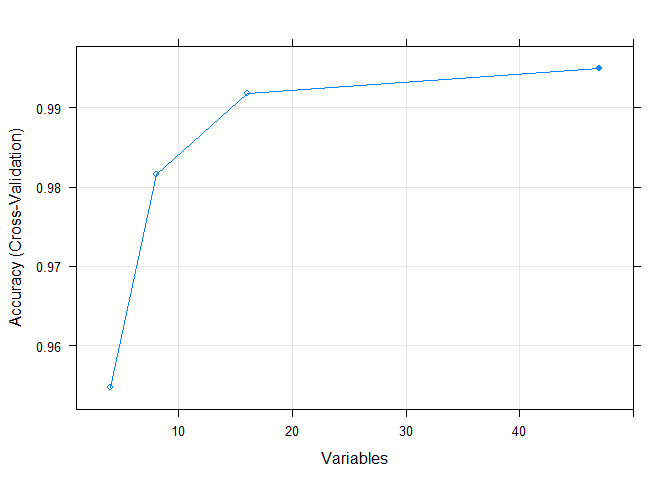

Human Activity Recognition using machine learning algorithms
================
MJ
July 24, 2016

Sinopsis
========

This study demonstrate the capabilities of a classifier trained based on [Weight Lifting Exercises Dataset](http://groupware.les.inf.puc-rio.br/har#weight_lifting_exercises#ixzz4ExRAtLLv) to predict how well Unilateral Dumbbell Biceps Curl activities were performed by the participants.

Final classifier shows high accuracy (greater than 99%) on the tests done.

Training and test set
=====================

Exploration, cleaning and partition of the data is done in this phase.

``` r
library(caret)
```

    ## Loading required package: lattice

    ## Loading required package: ggplot2

``` r
library(randomForest)
```

    ## randomForest 4.6-12

    ## Type rfNews() to see new features/changes/bug fixes.

    ## 
    ## Attaching package: 'randomForest'

    ## The following object is masked from 'package:ggplot2':
    ## 
    ##     margin

Loading data
------------

Six young health participants were asked to perform one set of 10 repetitions of the Unilateral Dumbbell Biceps Curl in five different fashions: exactly according to the specification (Class A), throwing the elbows to the front (Class B), lifting the dumbbell only halfway (Class C), lowering the dumbbell only halfway (Class D) and throwing the hips to the front (Class E). Read more [here](http://groupware.les.inf.puc-rio.br/har#weight_lifting_exercises#ixzz4ExRAtLLv).

Training and test data sets are loaded and seed is set to a value for reproducibility of the results of this study. As can be observed, 19622 samples of 159 potential features and the outcome are provided in the training set while 20 samples are provided in the test set that will be used as validation set in this study (only used in the end to perform prediction on them):

``` r
training <- read.csv("pml-training.csv")
test <- read.csv("pml-testing.csv")
dim(test)
```

    ## [1]  20 160

``` r
dim(training)
```

    ## [1] 19622   160

``` r
# For reproducibility
set.seed(8253)
```

Filtering data
--------------

Some features shows "division by zero" and "blanks" as values that must be treated as missing values in our data:

``` r
# Blancs of divisions by 0 as NA:
i <- training == "#DIV/0!"
training[i] <- NA

i <- training == ""
training[i] <- NA
```

However missing values are not supported by most machine learning algorithms. Therefore, features with high ratio of missing values must be discarded (as the number of complete observations will be minimal):

``` r
# Missing values are not good for machine learning algorithms
# Therefore, analysis of missing data is required.
naValues <- is.na(training)
feat <- names(training)
featClass <- unlist(lapply(training,class))
ratioNA <- colSums(naValues)/dim(naValues)[1]
expl <- data.frame(feat,featClass,ratioNA)

# Shows features with missing data:
g <- ggplot(aes(ratioNA,feat,color=featClass),data=expl)
g <- g + geom_point()
print(g)
```



As can be observed, there are features where more than 95% of their values are missing. That features will be discarded from the training set:

``` r
featToDelete <- expl[expl$ratioNA > 0.95,]$feat

# Subsetting data sets (excluding features with NA values)
trainSet <- training[, !(names(training) %in% featToDelete)]
```

There are no missing observations in the training set:

``` r
# TrainSet has no missing data now:
sum(is.na(trainSet))
```

    ## [1] 0

Additionally, there are features that by common sense must be avoided for prediction such as the name of the participant and they are filtered out:

``` r
# Features that should not be used for prediction:
# user_name cvtd_timestamp new_window X
# raw_timestamp_part_1 raw_timestamp_part_2 num_window 
trainSet <- subset(trainSet, select = -c(X,user_name,cvtd_timestamp,new_window))
trainSet <- subset(trainSet, select = -c(raw_timestamp_part_1,raw_timestamp_part_2,num_window))
```

Defining training set and test set
----------------------------------

In this step, a test set will be created from 20% of training data in order to have a small test set that could be used for classifiers comparison and further analysis.

``` r
# Training set will be divided into training (80%) and test set (20%)
trainSetIndex <- createDataPartition(trainSet$classe, p=0.8, list=FALSE)
newTrainSet <- trainSet[trainSetIndex,]
newTestSet <- trainSet[-trainSetIndex,]
```

Original test set will be used at the end of this study as a validation set just to submit predicted values on Coursera Project quizz.

Feature selection
=================

Feature selection is done in three steps:

1.  Verifying near zero variance predictors, however, none of the remaining fulfill the conditions:

``` r
# Are there near zero variance predictors?
nzvPredictors <- nearZeroVar(newTrainSet[,-53], saveMetrics=TRUE)
nzvPredictors
```

    ##                      freqRatio percentUnique zeroVar   nzv
    ## roll_belt             1.096819     7.5737308   FALSE FALSE
    ## pitch_belt            1.038961    11.1280973   FALSE FALSE
    ## yaw_belt              1.032020    11.8797376   FALSE FALSE
    ## total_accel_belt      1.071871     0.1847251   FALSE FALSE
    ## gyros_belt_x          1.049587     0.8153386   FALSE FALSE
    ## gyros_belt_y          1.136186     0.4331486   FALSE FALSE
    ## gyros_belt_z          1.061972     1.0510224   FALSE FALSE
    ## accel_belt_x          1.033871     1.0446525   FALSE FALSE
    ## accel_belt_y          1.088474     0.8917765   FALSE FALSE
    ## accel_belt_z          1.073759     1.8663609   FALSE FALSE
    ## magnet_belt_x         1.129693     1.9810179   FALSE FALSE
    ## magnet_belt_y         1.134122     1.8536212   FALSE FALSE
    ## magnet_belt_z         1.037736     2.8090961   FALSE FALSE
    ## roll_arm             53.720000    15.9755398   FALSE FALSE
    ## pitch_arm            72.621622    18.7081980   FALSE FALSE
    ## yaw_arm              34.000000    17.3577935   FALSE FALSE
    ## total_accel_arm       1.046544     0.4204089   FALSE FALSE
    ## gyros_arm_x           1.030733     4.0512135   FALSE FALSE
    ## gyros_arm_y           1.485294     2.3632078   FALSE FALSE
    ## gyros_arm_z           1.123188     1.5478693   FALSE FALSE
    ## accel_arm_x           1.030303     4.8792917   FALSE FALSE
    ## accel_arm_y           1.186747     3.3887509   FALSE FALSE
    ## accel_arm_z           1.147059     4.9620995   FALSE FALSE
    ## magnet_arm_x          1.028986     8.4655074   FALSE FALSE
    ## magnet_arm_y          1.100000     5.4907956   FALSE FALSE
    ## magnet_arm_z          1.000000     7.9877699   FALSE FALSE
    ## roll_dumbbell         1.045045    85.6869864   FALSE FALSE
    ## pitch_dumbbell        2.129310    83.4448054   FALSE FALSE
    ## yaw_dumbbell          1.171717    84.9417160   FALSE FALSE
    ## total_accel_dumbbell  1.090741     0.2675330   FALSE FALSE
    ## gyros_dumbbell_x      1.034068     1.5032805   FALSE FALSE
    ## gyros_dumbbell_y      1.265393     1.7389643   FALSE FALSE
    ## gyros_dumbbell_z      1.111111     1.2548570   FALSE FALSE
    ## accel_dumbbell_x      1.037736     2.6307408   FALSE FALSE
    ## accel_dumbbell_y      1.050761     2.9046436   FALSE FALSE
    ## accel_dumbbell_z      1.066327     2.5351933   FALSE FALSE
    ## magnet_dumbbell_x     1.212121     6.9494872   FALSE FALSE
    ## magnet_dumbbell_y     1.152318     5.2742213   FALSE FALSE
    ## magnet_dumbbell_z     1.006536     4.2423084   FALSE FALSE
    ## roll_forearm         11.704120    12.7524046   FALSE FALSE
    ## pitch_forearm        63.755102    17.4469711   FALSE FALSE
    ## yaw_forearm          16.265625    11.7905599   FALSE FALSE
    ## total_accel_forearm   1.186192     0.4331486   FALSE FALSE
    ## gyros_forearm_x       1.036496     1.8472514   FALSE FALSE
    ## gyros_forearm_y       1.094915     4.6117587   FALSE FALSE
    ## gyros_forearm_z       1.129630     1.9045799   FALSE FALSE
    ## accel_forearm_x       1.084507     5.0003185   FALSE FALSE
    ## accel_forearm_y       1.146341     6.2360660   FALSE FALSE
    ## accel_forearm_z       1.042373     3.5925855   FALSE FALSE
    ## magnet_forearm_x      1.060606     9.4337219   FALSE FALSE
    ## magnet_forearm_y      1.029412    11.7459711   FALSE FALSE
    ## magnet_forearm_z      1.021277    10.5165934   FALSE FALSE

1.  Avoiding high correlation features. If correlation is greater than 0.9 between two features, redundant features will be discarded:

``` r
# Correlations
correlationMatrix <- cor(newTrainSet[, !(names(newTrainSet) %in% c("classe"))], use = "pairwise.complete.obs")
highCorrelation <- findCorrelation(correlationMatrix,cutoff=0.9)
# These are the features that are highly correlated:
names(newTrainSet)[highCorrelation]
```

    ## [1] "accel_belt_z" "roll_belt"    "accel_belt_y" "accel_belt_x"
    ## [5] "gyros_arm_x"

These features are discarded:

``` r
# Filtering out the high correlated ones:
newTrainSet <- newTrainSet[,-highCorrelation]
```

1.  Applying Recursive Feature elimination using random forest classifiers and 10-fold cross-validation to verify the feature importance over the original data set and the accuracy obtained for the most important features selected on each stage:

``` r
# Feature Selection
# Recursive Feature elimination using random forest

# Define the control using a random forest selection function
control <- rfeControl(functions=rfFuncs, method="cv", number=10)
# run the RFE algorithm
rfeFeatSelection <- rfe(newTrainSet[, !(names(newTrainSet) %in% c("classe"))], newTrainSet$classe, rfeControl=control)
```

Once the method is applied, the following figure is showing accuracy (after 10-fold cross-validation) versus number of variables used as predictors. Maximum accuracy is achieved once all predictors are taking into account:

``` r
# plot the results
plot(rfeFeatSelection, type=c("g", "o"))
```



Summary of the results is showing that all predictors are choosen by the method:

``` r
# summarize the results
rfeFeatSelection
```

    ## 
    ## Recursive feature selection
    ## 
    ## Outer resampling method: Cross-Validated (10 fold) 
    ## 
    ## Resampling performance over subset size:
    ## 
    ##  Variables Accuracy  Kappa AccuracySD  KappaSD Selected
    ##          4   0.9548 0.9428   0.004793 0.006062         
    ##          8   0.9816 0.9767   0.004759 0.006017         
    ##         16   0.9918 0.9897   0.001847 0.002337         
    ##         47   0.9949 0.9936   0.002036 0.002576        *
    ## 
    ## The top 5 variables (out of 47):
    ##    yaw_belt, magnet_dumbbell_z, pitch_belt, magnet_dumbbell_y, pitch_forearm

Therefore, the final list of features that will be used is:

``` r
# list the chosen features
predictors(rfeFeatSelection)
```

    ##  [1] "yaw_belt"             "magnet_dumbbell_z"    "pitch_belt"          
    ##  [4] "magnet_dumbbell_y"    "pitch_forearm"        "gyros_belt_z"        
    ##  [7] "magnet_belt_y"        "magnet_belt_z"        "magnet_forearm_z"    
    ## [10] "roll_arm"             "accel_dumbbell_y"     "roll_forearm"        
    ## [13] "roll_dumbbell"        "accel_dumbbell_z"     "gyros_arm_y"         
    ## [16] "magnet_dumbbell_x"    "yaw_arm"              "magnet_belt_x"       
    ## [19] "accel_forearm_x"      "gyros_forearm_y"      "yaw_dumbbell"        
    ## [22] "accel_forearm_z"      "total_accel_dumbbell" "magnet_arm_z"        
    ## [25] "total_accel_belt"     "gyros_dumbbell_y"     "magnet_forearm_y"    
    ## [28] "gyros_dumbbell_x"     "accel_forearm_y"      "accel_arm_y"         
    ## [31] "yaw_forearm"          "accel_dumbbell_x"     "pitch_arm"           
    ## [34] "gyros_dumbbell_z"     "accel_arm_z"          "gyros_forearm_z"     
    ## [37] "total_accel_forearm"  "magnet_forearm_x"     "gyros_belt_x"        
    ## [40] "total_accel_arm"      "magnet_arm_x"         "gyros_belt_y"        
    ## [43] "magnet_arm_y"         "accel_arm_x"          "gyros_forearm_x"     
    ## [46] "pitch_dumbbell"       "gyros_arm_z"

Classifiers comparison
======================

This section compares two classifiers: decission trees and random forest.

Decission trees
---------------

Classification based on a trained decission tree is done:

``` r
# First model: Classification trees
mod1 <- train(classe ~.,method="rpart",data=newTrainSet)
```

    ## Loading required package: rpart

The accuracy in the test set created during this exercise (out sample) is:

``` r
# On test set (out sample)
confusionMatrix(newTestSet$classe,predict(mod1,newTestSet))
```

    ## Confusion Matrix and Statistics
    ## 
    ##           Reference
    ## Prediction    A    B    C    D    E
    ##          A 1011   12   72   20    1
    ##          B  321  258  148   31    1
    ##          C  315   22  272   75    0
    ##          D  238  119   69  166   51
    ##          E  162  137  165   31  226
    ## 
    ## Overall Statistics
    ##                                          
    ##                Accuracy : 0.4927         
    ##                  95% CI : (0.477, 0.5085)
    ##     No Information Rate : 0.5218         
    ##     P-Value [Acc > NIR] : 0.9999         
    ##                                          
    ##                   Kappa : 0.3375         
    ##  Mcnemar's Test P-Value : <2e-16         
    ## 
    ## Statistics by Class:
    ## 
    ##                      Class: A Class: B Class: C Class: D Class: E
    ## Sensitivity            0.4939  0.47080  0.37466  0.51393  0.81004
    ## Specificity            0.9440  0.85156  0.87113  0.86750  0.86416
    ## Pos Pred Value         0.9059  0.33992  0.39766  0.25816  0.31345
    ## Neg Pred Value         0.6309  0.90834  0.85983  0.95213  0.98345
    ## Prevalence             0.5218  0.13969  0.18506  0.08233  0.07112
    ## Detection Rate         0.2577  0.06577  0.06933  0.04231  0.05761
    ## Detection Prevalence   0.2845  0.19347  0.17436  0.16391  0.18379
    ## Balanced Accuracy      0.7190  0.66118  0.62289  0.69072  0.83710

The accuracy on test set is poor. Therefore, there is the need of another classifier to improve prediction results.

Random forest
-------------

Random forest is used to improve the results and achieve higher accuracy as could be observed in previous step when recursive feature elimination was performed using 10-fold cross-validation with random forest classifiers.

``` r
# Second model: Random forest
mod2 <- randomForest(classe ~., data = newTrainSet, importance = FALSE)
# Order by importance
order(varImp(mod2), decreasing = TRUE)
```

    ##  [1]  2 34  1 36 33 35  8  9 32  6 22 30 10  3 31 42 47 19 25  7 44 27 29
    ## [24] 24 12 20 46 45 16 21 11 37 17 23 14 43 18  5 40 26  4 38 13 41 28 39
    ## [47] 15

The accuracy in the test set created during this exercise (out sample) is high (over 99%):

``` r
# On test set (out sample)
confusionMatrix(newTestSet$classe,predict(mod2,newTestSet))
```

    ## Confusion Matrix and Statistics
    ## 
    ##           Reference
    ## Prediction    A    B    C    D    E
    ##          A 1115    0    0    0    1
    ##          B    3  755    1    0    0
    ##          C    0    5  679    0    0
    ##          D    0    0    9  634    0
    ##          E    0    0    1    1  719
    ## 
    ## Overall Statistics
    ##                                           
    ##                Accuracy : 0.9946          
    ##                  95% CI : (0.9918, 0.9967)
    ##     No Information Rate : 0.285           
    ##     P-Value [Acc > NIR] : < 2.2e-16       
    ##                                           
    ##                   Kappa : 0.9932          
    ##  Mcnemar's Test P-Value : NA              
    ## 
    ## Statistics by Class:
    ## 
    ##                      Class: A Class: B Class: C Class: D Class: E
    ## Sensitivity            0.9973   0.9934   0.9841   0.9984   0.9986
    ## Specificity            0.9996   0.9987   0.9985   0.9973   0.9994
    ## Pos Pred Value         0.9991   0.9947   0.9927   0.9860   0.9972
    ## Neg Pred Value         0.9989   0.9984   0.9966   0.9997   0.9997
    ## Prevalence             0.2850   0.1937   0.1759   0.1619   0.1835
    ## Detection Rate         0.2842   0.1925   0.1731   0.1616   0.1833
    ## Detection Prevalence   0.2845   0.1935   0.1744   0.1639   0.1838
    ## Balanced Accuracy      0.9985   0.9961   0.9913   0.9978   0.9990

The accuracy in the data set used for training (in sample) is 100% (able to fit all data):

``` r
# On training set (in sample)
confusionMatrix(newTrainSet$classe,predict(mod2,newTrainSet))
```

    ## Confusion Matrix and Statistics
    ## 
    ##           Reference
    ## Prediction    A    B    C    D    E
    ##          A 4464    0    0    0    0
    ##          B    0 3038    0    0    0
    ##          C    0    0 2738    0    0
    ##          D    0    0    0 2573    0
    ##          E    0    0    0    0 2886
    ## 
    ## Overall Statistics
    ##                                      
    ##                Accuracy : 1          
    ##                  95% CI : (0.9998, 1)
    ##     No Information Rate : 0.2843     
    ##     P-Value [Acc > NIR] : < 2.2e-16  
    ##                                      
    ##                   Kappa : 1          
    ##  Mcnemar's Test P-Value : NA         
    ## 
    ## Statistics by Class:
    ## 
    ##                      Class: A Class: B Class: C Class: D Class: E
    ## Sensitivity            1.0000   1.0000   1.0000   1.0000   1.0000
    ## Specificity            1.0000   1.0000   1.0000   1.0000   1.0000
    ## Pos Pred Value         1.0000   1.0000   1.0000   1.0000   1.0000
    ## Neg Pred Value         1.0000   1.0000   1.0000   1.0000   1.0000
    ## Prevalence             0.2843   0.1935   0.1744   0.1639   0.1838
    ## Detection Rate         0.2843   0.1935   0.1744   0.1639   0.1838
    ## Detection Prevalence   0.2843   0.1935   0.1744   0.1639   0.1838
    ## Balanced Accuracy      1.0000   1.0000   1.0000   1.0000   1.0000

Accuracy shows impressive results in the test set. This classifier is used for final prediction over the original test data set.

Final prediction
================

Random forest model trained in previous section is used to predict on the original test set. The results of the prediction are shown below:

``` r
# On validation set, the prediction is:
tmp <- as.data.frame(predict(mod2,test))

finalPred <- cbind(row.names(tmp),tmp)
names(finalPred) <- c("problem_id","prediction")
finalPred
```

    ##    problem_id prediction
    ## 1           1          B
    ## 2           2          A
    ## 3           3          B
    ## 4           4          A
    ## 5           5          A
    ## 6           6          E
    ## 7           7          D
    ## 8           8          B
    ## 9           9          A
    ## 10         10          A
    ## 11         11          B
    ## 12         12          C
    ## 13         13          B
    ## 14         14          A
    ## 15         15          E
    ## 16         16          E
    ## 17         17          A
    ## 18         18          B
    ## 19         19          B
    ## 20         20          B

Conclussions
============

Random forest overperformed over a classification tree and high accuracy results are expected as could be seen in this exercise.
